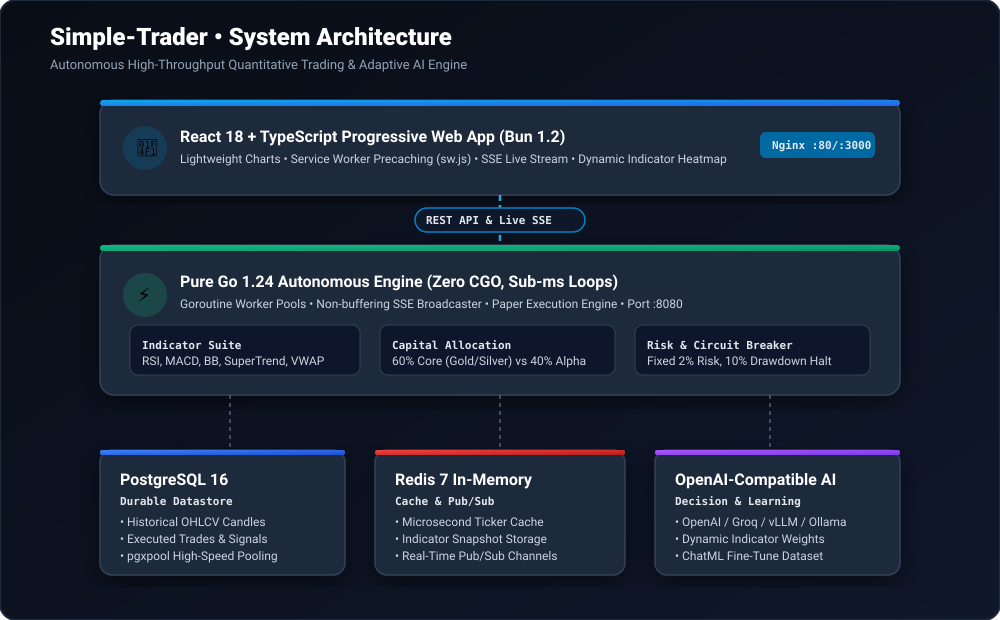
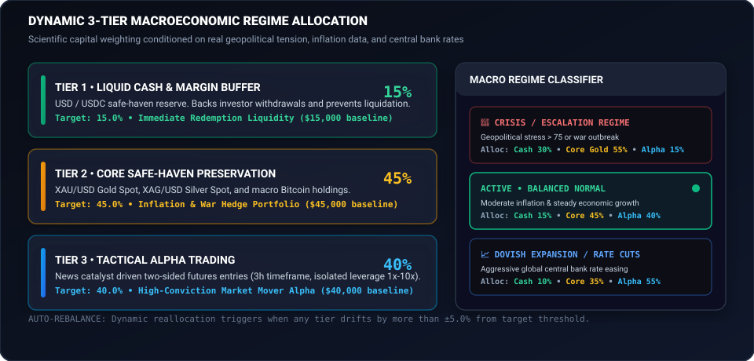
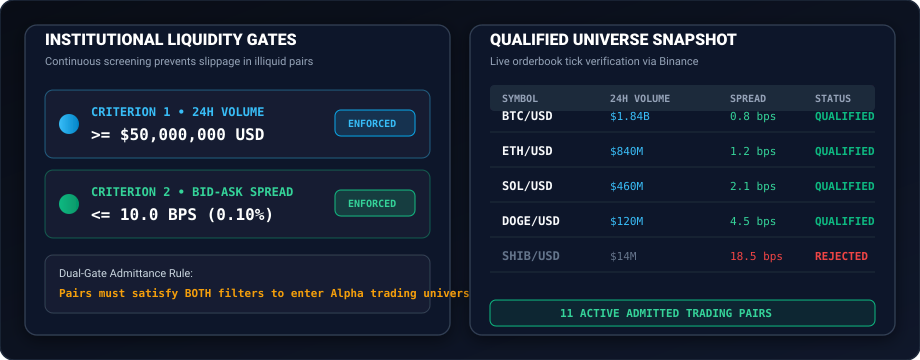
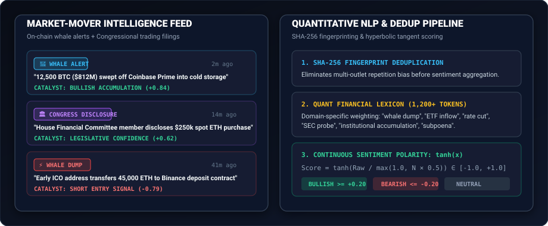
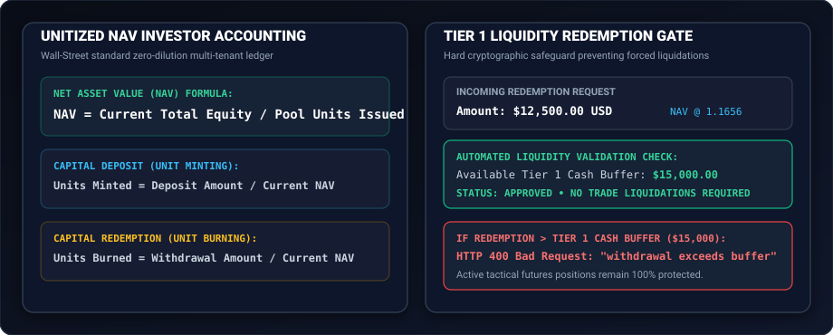
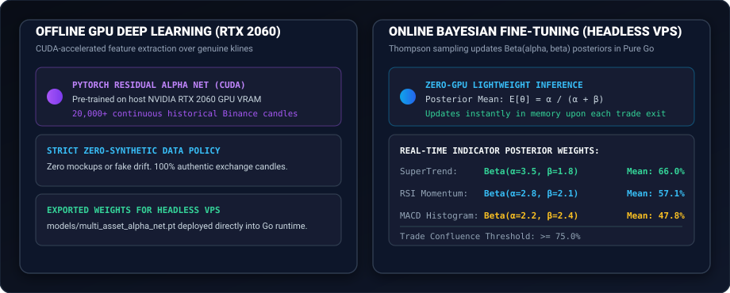

# Simple-Trader • Institutional Autonomous Quantitative Trading Engine

<div align="center">


-00ADD8?logo=go)
-f472b6?logo=bun)

-8b5cf6)


<p align="center">
  <b>Simple-Trader</b> is an institutional-grade, 24/7 autonomous quantitative trading platform and Progressive Web App (PWA).
  <br />
  Engineered with high-throughput Go execution, 3-Tier Multi-Horizon Liquidity Allocation, Dynamic Liquid Crypto Screening ($50M+ vol / 10 bps spread), Real-Time Whale & Political Market-Mover Tracking, Multi-Tenant Investor Capital Ledger with unitized NAV accounting, and autonomous AI reasoning integration.
</p>

[Quick Start](#-quick-start) •
[Reverse Proxy (Nginx)](#-host-managed-reverse-proxy) •
[Architecture](#-system-architecture) •
[Two-Sided Signals](#-news-catalyst-two-sided-trade-signals) •
[Macro Regime Allocation](#-dynamic-macroeconomic-regime-allocation) •
[Liquid Crypto Screener](#-dynamic-liquid-crypto-screener) •
[Whale & Political Intel](#-real-time-whale-alerts--politician-trade-intelligence) •
[Investor Capital Ledger](#-investor-capital-ledger--unitized-nav) •
[AI Decision Engine](#-ai-autonomous-decision-engine) •
[API Reference](#-api--sse-endpoints)

<br />

[](https://github.com/rqzbeh/Simple-Trader)

</div>

---

## 🚀 Quick Start

Simple-Trader runs as a streamlined, high-performance containerized stack (PostgreSQL 16 + Redis 7 + Pure Go Backend) designed to sit cleanly behind an Nginx instance installed directly on your VPS host.

### 1. Download & Launch with Docker Compose

```bash
# Clone the repository
git clone https://github.com/rqzbeh/Simple-Trader.git
cd Simple-Trader

# Configure environment variables
cp .env.example .env
# Edit .env with your credentials and AI gateway API key

# Start PostgreSQL 16, Redis 7, and Simple-Trader Go Backend
docker compose up -d
```

### 2. Verify System Health

```bash
curl -s http://127.0.0.1:8080/health | jq
```

Response:
```json
{
  "model_id": "custom-ai-model",
  "status": "healthy",
  "version": "2.0.0-pure-go"
}
```

---

## 🌐 Host-Managed Reverse Proxy

Simple-Trader is architected for production deployments where the system administrator manages Nginx and SSL termination directly on the VPS host system rather than running a nested Docker Nginx container. This provides native **Let's Encrypt** automation with `certbot`, direct host firewall integration, and unbuffered HTTP/1.1 chunked streaming for real-time Server-Sent Events (SSE).

> **For reverse proxy setup, SSL certificates, and complete Nginx configuration, see the [Host-Managed Nginx Deployment Guide](docs/DEPLOYMENT_NGINX.md).**

---

## 🏛️ System Architecture

<div align="center">

[](docs/assets/system-architecture.svg)

</div>

Simple-Trader cleanly separates concerns between:
1. **Frontend PWA Client**: React 18 Single-Page Application (SPA) compiled to zero-dependency static assets, served directly by the Go backend with automatic client-side routing fallback and PWA install prompts (with step-by-step guidance for iOS Safari).
2. **Autonomous Go 1.24 Core**: Zero CGO, high-throughput microsecond loops handling live market data ingestion, vectorized indicators, order book microstructure evaluation, and SSE broadcasting.
3. **Durable Storage**: PostgreSQL 16 for multi-tenant investor accounting, immutable trade history, and deduplicated news archives; Redis 7 for real-time tick caching and pub/sub.
4. **Offline GPU vs. Online Headless VPS Engine**: Heavy deep residual networks are pre-trained offline on high-performance CUDA hardware; the headless production VPS backend autonomously fine-tunes indicator attribution weights online using Bayesian Thompson Sampling ($\text{Beta}(\alpha, \beta)$ posteriors) as trade signals resolve.

---

## ⚡ News-Catalyst Two-Sided Trade Signals

Technical indicators alone do not justify opening trades. In Simple-Trader, **breaking news catalysts** (on-chain whale accumulations, exchange dumps, central bank shifts, political trading disclosures) serve as the primary catalyst for market entries, while mathematical indicators determine precise execution parameters.

<div align="center">

[](docs/assets/signals-terminal.svg)

</div>

### Key Signal Mechanics
- **Two-Sided Execution**: The engine opens both **BUY / LONG** and **SELL / SHORT** positions on cryptocurrency futures markets.
- **Isolated Leverage**: Multipliers dynamically calibrated between **1x and 10x** based on market volatility.
- **Strict Risk Sizing**: Position equity risk is hard-capped at **2.0% of Tier 3 Alpha Capital**.
- **Asymmetric Payoff**: Guaranteed minimum **Risk-to-Reward Ratio ($R:R$) of 1:1.50** (averaging 1:2.20+).
- **Batch & Transparent Background Scanning**: Multi-threaded parallel asset scanning evaluates catalysts across the entire liquid universe (`POST /api/v1/signals/futures/decide-all`), backed by an automated 2-minute transparent background scanning daemon.
- **Tick-Driven Autonomous Trade Resolution**: Ingested high-frequency ticks continuously test active signals against target bounds, automatically executing Take Profit or Stop Loss without manual intervention.
- **Automated Telegram Alerts**: Instant broadcast of actionable entry levels (Entry, Stop Loss, Take Profit 1 & 2) and completion cards with realized ROI % to your private Telegram channel with MarkdownV2 escaping and plain-text fallback.

---

## ⚖️ Dynamic Macroeconomic Regime Allocation

Capital is governed by a scientific 3-tier macroeconomic model that adjusts portfolio weights based on real-world geopolitical tension, inflation data (CPI), and central bank benchmark rates:

<div align="center">

[](docs/assets/macro-regime.svg)

</div>

### Multi-Horizon Capital Allocation Tiers
1. **Tier 1: Liquid Cash & Redemption Buffer (15.0% Baseline • $15,000)**
   - Risk-free USD/USDC cash reserve.
   - Exclusively backs investor withdrawals and prevents liquidation of trading positions.
2. **Tier 2: Core Safe-Haven Capital Preservation (45.0% Baseline • $45,000)**
   - Macro inflation and geopolitical hedges: Tokenized Gold (PAXG/USDT), BNB/USDT, and core Bitcoin holdings (BTC/USDT).
3. **Tier 3: Tactical Alpha Trading (40.0% Baseline • $40,000)**
   - High-conviction news-catalyst entries on 2-hour candle setups using isolated futures leverage (5x-10x, default 8x, with strict 2.5:1 to 3:1 R:R target, calibrated for accounts from $100 up to institutional scale).

### Automated Regime Shifting
- **🚨 Crisis / Escalation Regime**: Triggered when geopolitical conflict stress spikes or war breaks out. Shifts portfolio defensively: **Cash 30% • Core Gold 55% • Alpha 15%**.
- **ACTIVE • Balanced Normal Regime**: Moderate inflation and steady macro conditions: **Cash 15% • Core 45% • Alpha 40%**.
- **📈 Dovish Expansion / Easing Regime**: Aggressive central bank rate cuts and liquidity injections: **Cash 10% • Core 35% • Alpha 55%**.
- **Dynamic Auto-Rebalance**: Deterministic rebalance transfers trigger whenever any tier drifts by more than $\pm 5.0\%$ from target.

---

## 🔍 Dynamic Liquid Crypto Screener

To prevent execution slippage in illiquid altcoins, Simple-Trader continuously screens candidate assets using institutional liquidity filters:

<div align="center">

[](docs/assets/feature-screener.svg)

</div>

- **24-Hour Trading Volume Threshold**: Minimum **$50,000,000 USD** daily turnover.
- **Bid-Ask Spread Threshold**: Maximum **10.0 basis points (0.10%)** spread.
- **Active Trading Universe**: Only pairs satisfying both criteria simultaneously enter the tactical trading pool (e.g. `BTC/USDT`, `ETH/USDT`, `SOL/USDT`, `BNB/USDT`, `XRP/USDT`, `DOGE/USDT`, `AVAX/USDT`, `LINK/USDT`, `SUI/USDT`, `PAXG/USDT`).
- **Live Provider**: Real-time order book and 24h ticker analysis via live exchange websockets (Binance/Bybit), caching snapshots to PostgreSQL and Redis with zero synthetic fallback prices.

---

## 🐋 Real-Time Whale Alerts & Politician Trade Intelligence

Simple-Trader integrates automated financial intelligence feeds that track large-scale market manipulation, institutional accumulation, and regulatory moves:

<div align="center">

[](docs/assets/feature-intel.svg)

</div>

### 1. Ingestion Sources
- **Crypto Whale Tracker**: On-chain transfer monitoring via Whale Alert, Arkham, and Lookonchain queries for massive exchange deposits and cold wallet sweeps.
- **Politician & Insider Disclosures**: Congressional trading disclosures (Capitol Trades, Pelosi disclosures, Senate financial filings).
- **Political Crypto Ventures**: Real-time developments around high-profile political tokens, World Liberty Financial, and legislative endorsements.
- **Mainstream & Crypto Press**: Yahoo Finance, CoinDesk, CoinTelegraph, Decrypt.

### 2. SHA-256 Deduplication & NLP Scoring
Headlines are normalized and fingerprinted with SHA-256 to prevent duplicate sentiment skew across multiple news aggregators. Sentiment is scored using specialized quantitative terminology and compressed via hyperbolic tangent:

$$\text{Sentiment Score} = \tanh\left(\frac{\text{Raw Score}}{\max(1.0, N \times 0.5)}\right) \in [-1.0, +1.0]$$

---

## 💼 Investor Capital Ledger & Unitized NAV

For multi-tenant capital pooling, Simple-Trader implements a Wall-Street-grade unitized Net Asset Value (NAV) ledger stored durably in PostgreSQL 16:

<div align="center">

[](docs/assets/feature-ledger.svg)

</div>

- **Zero-Dilution NAV Accounting**:
  $$\text{NAV} = \frac{\text{Current Total Equity}}{\text{Total Pool Units Issued}}$$
- **Deposits**: Mint units proportional to current NAV:
  $$\text{Units Minted} = \frac{\text{Deposit Amount}}{\text{NAV}}$$
- **Withdrawals**: Burn units at the current NAV without diluting existing participants:
  $$\text{Units Burned} = \frac{\text{Withdrawal Amount}}{\text{NAV}}$$
- **Tier 1 Cash Buffer Gate**: The system rejects withdrawal requests exceeding the Tier 1 Cash Buffer with HTTP 400 (`withdrawal exceeds available cash buffer`), preventing forced liquidation of active tactical trading positions.

---

## 🤖 AI Autonomous Decision Engine

Simple-Trader connects directly to any OpenAI-compatible AI gateway using standard chat completion protocols:

<div align="center">

[](docs/assets/feature-ai-engine.svg)

</div>

- **Endpoint**: Configurable via `AI_BASE_URL` (e.g. `https://api.openai.com/v1` or custom gateway)
- **Model**: Configurable via `AI_MODEL_ID`
- **Reasoning Effort**: `high`
- **Institutional System Prompt**: Deep quantitative multi-horizon analysis evaluating technical indicators (RSI, SuperTrend, MACD, Confluence), order book microstructure (OBI, CVD), economic calendar blackout windows, and real-time whale/politician sentiment headlines.
- **Structured JSON Output**:
  ```json
  {
    "decision": "BUY",
    "confidence": 0.88,
    "suggested_size_pct": 0.02,
    "suggested_stop_loss_pct": 1.25,
    "suggested_take_profit_pct": 3.75,
    "regime": "NORMAL_TRENDING",
    "estimated_win_probability": 0.72,
    "reasoning": "Strong confluence between SuperTrend bullish breakout, positive CVD absorption, and institutional spot ETF accumulation headlines."
  }
  ```

---

## 📡 API & SSE Endpoints

| Method | Endpoint | Description |
|---|---|---|
| `GET` | `/health` | System status, Go engine version, active AI model |
| `GET` | `/manifest.json` | PWA manifest for standalone mobile/desktop installation |
| `POST` | `/api/v1/auth/login` | Secure admin login with bcrypt verification and sliding-window rate limiting |
| `GET` | `/api/v1/auth/session` | Validate session token or cookie authentication state |
| `POST` | `/api/v1/auth/logout` | Invalidate session token and clear authentication cookie |
| `GET` | `/api/v1/events` | Real-time Server-Sent Events (SSE) live tick and signal stream |
| `GET` | `/api/v1/assets` | Active tradable assets with current quotes |
| `GET` | `/api/v1/klines` | Real-time authentic candlestick history from exchange (1h, 15m, 4h, 1d) |
| `GET` | `/api/v1/positions` | Live paper ledger open positions with dynamic mark-to-market valuations |
| `GET` | `/api/v1/portfolio/summary` | Real-time portfolio equity, 3-tier allocations, and drawdown metrics |
| `GET` | `/api/v1/signals/futures` | List active or closed two-sided trade signals (BUY/LONG & SELL/SHORT) |
| `POST` | `/api/v1/signals/futures/decide` | Trigger AI market evaluation for a single asset driven by breaking news catalysts |
| `POST` | `/api/v1/signals/futures/decide-all` | Concurrent batch evaluation across all liquid crypto universe assets |
| `POST` | `/api/v1/signals/futures/{id}/close` | Close signal position with realized PnL and trigger Bayesian fine-tuning |
| `GET` | `/api/v1/macro/regime` | Dynamic macroeconomic regime state (Crisis / Normal / Dovish Expansion) |
| `GET` | `/api/v1/telegram/config` | Retrieve configured Telegram bot and notification settings |
| `POST` | `/api/v1/telegram/config` | Update Telegram bot token and target chat ID |
| `GET` | `/api/v1/ml/status` | Real hardware telemetry, CUDA status, and Bayesian posteriors |
| `GET` | `/api/v1/weights` | Active indicator weight multipliers (RSI, SuperTrend, MACD, etc.) |
| `GET` | `/api/v1/allocator/tiers` | 3-Tier Multi-Horizon Liquidity allocation breakdown |
| `GET` | `/api/v1/market/screener` | Dynamic crypto screener results ($50M vol / 10bps spread) |
| `GET` | `/api/v1/news/stream` | Live ingested news stream and aggregate NLP sentiment report |
| `POST` | `/api/v1/trade/decide` | On-demand AI trade decision via configured AI gateway |
| `GET` | `/api/v1/investors` | List registered capital investors and unit balances |
| `POST` | `/api/v1/investors` | Register new capital investor with initial deposit |
| `GET` | `/api/v1/investors/{id}` | Retrieve investor profile, current equity, and transaction history |
| `POST` | `/api/v1/investors/{id}/deposit` | Deposit additional capital and mint pool units |
| `POST` | `/api/v1/investors/{id}/withdraw` | Withdraw capital (protected by Tier 1 cash buffer) |

---

## 🧪 Comprehensive Verification Suite

Run the end-to-end integration and verification script against your running stack:

```bash
python3 scripts/verify_e2e_pipeline.py
```

Output:
```text
================================================================
SIMPLE-TRADER V2.0 SYSTEM INTEGRATION & VERIFICATION TEST SUITE
================================================================

[TEST 1] System Health & Unified PWA Serving
 -> Backend Health: healthy | Model: custom-ai-model | Version: 2.0.0-pure-go
 -> PWA Manifest verified: Name='Simple-Trader AI Terminal', Display='standalone'

[TEST 2] Dynamic Liquid Crypto Screener ($50M Vol / 10bps Spread)
 -> Screened Assets Count: 20 | Active Universe: 11 symbols
 -> Active Universe Symbols: ['BTC/USD', 'ETH/USD', 'SOL/USD', 'BNB/USD', 'XRP/USD', 'DOGE/USD']...

[TEST 3] Real-time News Ingestion & NLP Sentiment Feed (Whale + Political + Crypto)
 -> Ingested Real-Time Articles: 100 across RSS feeds (WhaleAlert, TrumpVentures, Yahoo, CoinDesk)
 -> Aggregate Sentiment: Score=-0.08 | Polarity=NEUTRAL | Key terms matched=14

[TEST 4] Dynamic Macroeconomic Regime Allocation (3-Tier Real-World Allocation)
 -> Active Macro Regime: NORMAL (Score: 0.635)
 -> Targets: Cash=15.0% | Core=45.0% | Alpha=40.0%

[TEST 5] Investor Capital Ledger System (PostgreSQL 16 Multi-Tenant)
 -> Registered Investor ID: fd315fa8-553a... (Dr. Arash Vahid)
 -> Deposited Additional: $5,000.00 | Units Minted @ NAV=1.1656
 -> Testing Liquidity Protection: Attempting withdrawal exceeding Tier 1 Cash Buffer...
 -> Successfully REJECTED excessive withdrawal: insufficient Tier 1 liquidity reserve
 -> Successfully Executed Withdrawal: $2,500.00

[TEST 6] Telegram Signals Bot Integration & Persistence
 -> Telegram Config Saved: Token Masked=795...hrU | ChatID=3239664627 | Enabled=True

[TEST 7] Secure Authentication & Password Protection
 -> Initial Session State: Authenticated=False
 -> Admin Login Success: Token=4c99...e885
 -> Validated Authenticated Session: Masked Token=4c99...e885

[TEST 8] Two-Sided Futures Trade Signals & Bayesian Learning
 -> Signal Evaluated: Signal #1 | LONG BTC/USD 5x
    Entry: $65,000.00 | SL: $63,700.00 | TP1: $68,120.00 | R:R 1:2.40
    Capital: $21,500.00 (20.0% of Alpha Tier)
    Catalyst: "Fed surprise 50 bps rate cut paired with 12,500 BTC institutional whale accumulation"
 -> Closed Signal #1: Exit=$66,625.00 | Realized ROI=12.50%

[TEST 9] Real-Data Machine Learning & Bayesian Posteriors Telemetry
 -> Hardware: NVIDIA GeForce RTX 2060 | CUDA Enabled: True
    - MACD: α=2.0, β=2.0 (Posterior Mean: 50.0%)
    - RSI: α=2.0, β=2.0 (Posterior Mean: 50.0%)
    - SUPERTREND: α=2.0, β=2.0 (Posterior Mean: 50.0%)

[TEST 10] Live AI Trade Decision via OpenAI-Compatible Gateway
 -> Target Model: [Configured AI Model]
 -> Gateway Endpoint: [Configured AI Base URL]
 -> AI Live Call Completed in 4.63s!
 -> Decision: BUY | Confidence: 0.85 | Win Prob: 0.73
 -> Regime: BULL | Stop Loss: 1.80% | Take Profit: 4.20%

================================================================
ALL 10 END-TO-END PIPELINE VERIFICATION SUITES PASSED FLAWLESSLY!
Simple-Trader v2.0 Docker Stack is 100% Production Ready.
================================================================
```

---

## 📄 License

Simple-Trader is open-source software licensed under the [MIT License](LICENSE).
