# Simple-Trader • Institutional Autonomous Quantitative Trading Terminal

<div align="center">


-00ADD8?logo=go)
-f472b6?logo=bun)


<p align="center">
  <b>Simple-Trader</b> is an institutional-grade, 24/7 autonomous quantitative trading terminal and Progressive Web App (PWA).
  <br />
  <b>One decision core — Jev + 9Router.</b> News, indicators, and ML models are context feeders with no agency.
  Zero fallbacks. Every failure is an explicit, named error.
</p>

[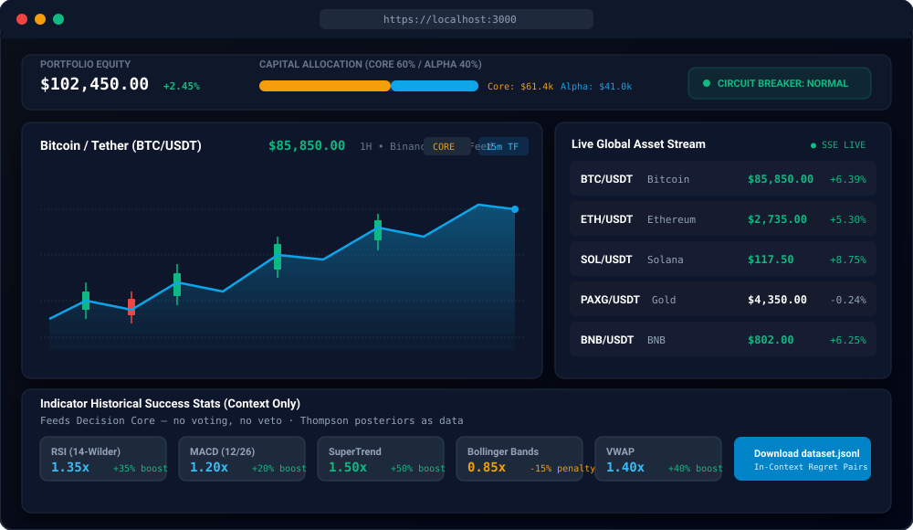](https://github.com/rqzbeh/Simple-Trader)

[Quick Start](#-quick-start) •
[Decision Core](#-decision-core) •
[v3.1 Features](#-v31-features) •
[Signal Pipeline](#-signal-pipeline--position-lifecycle) •
[Asset Universe](#-asset-universe-123-instruments) •
[System Stats](#-system-stats--settings)

</div>

---

## 🖼️ The Terminal

<table>
  <tr>
    <td width="50%" align="center">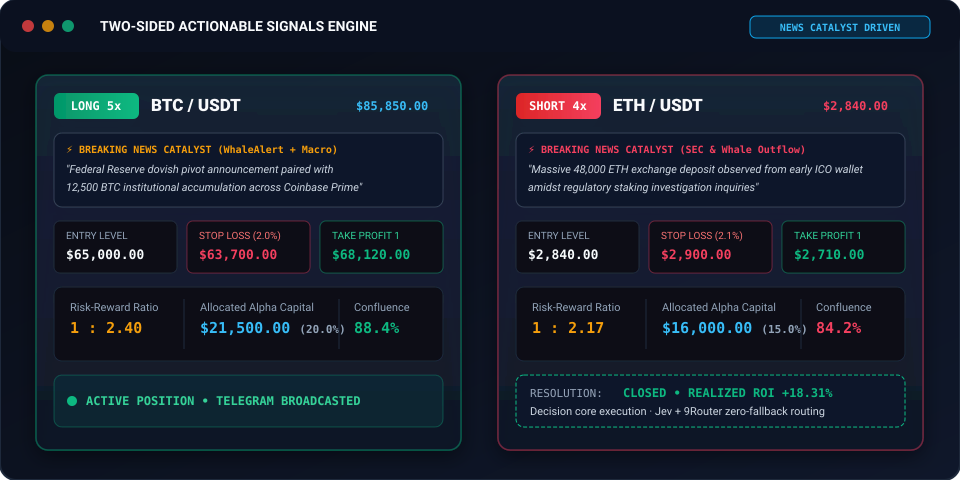<br/><sub><b>Live signals terminal</b> — two-sided futures cards, catalyst-first entries</sub></td>
    <td width="50%" align="center">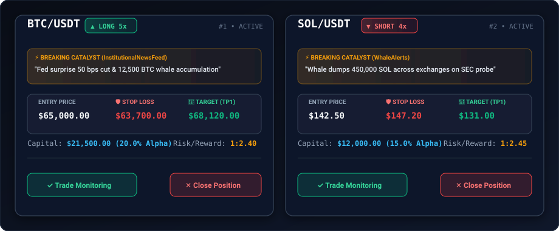<br/><sub><b>Catalyst-driven entries</b> — news cluster → core judgment</sub></td>
  </tr>
  <tr>
    <td align="center">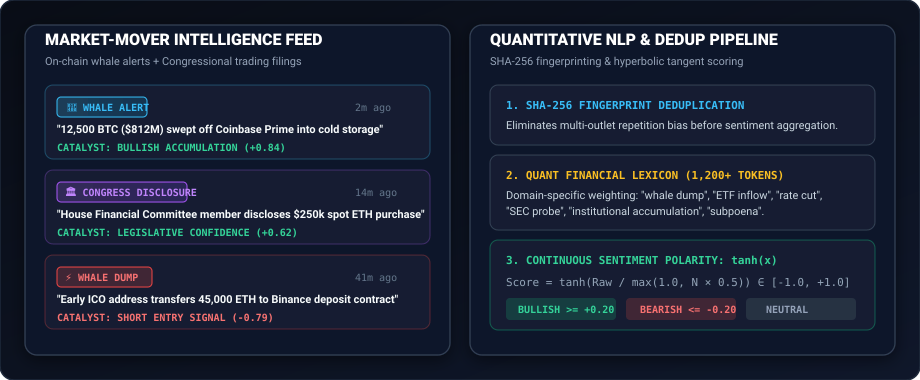<br/><sub><b>News stream</b> — core-classified BULLISH/BEARISH/NEUTRAL/MIXED</sub></td>
    <td align="center">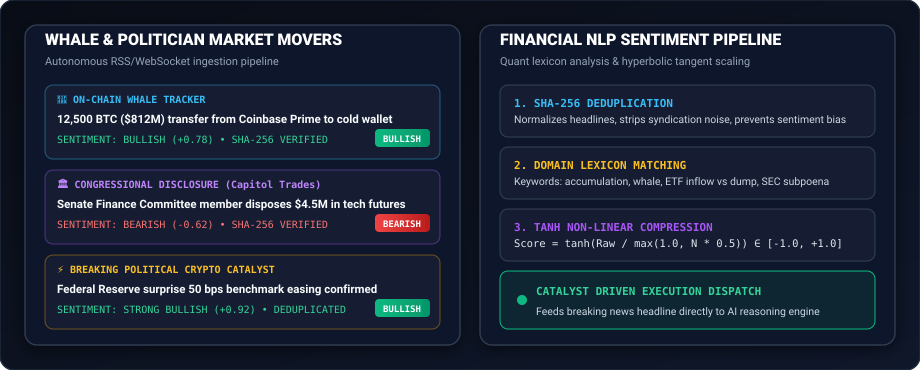<br/><sub><b>Whale &amp; flow intel</b> — context feeders, zero agency</sub></td>
  </tr>
  <tr>
    <td align="center">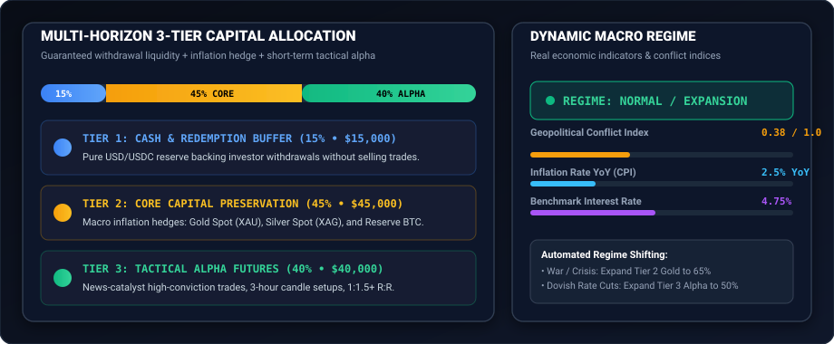<br/><sub><b>Macro calendar</b> — event halts as state fields</sub></td>
    <td align="center">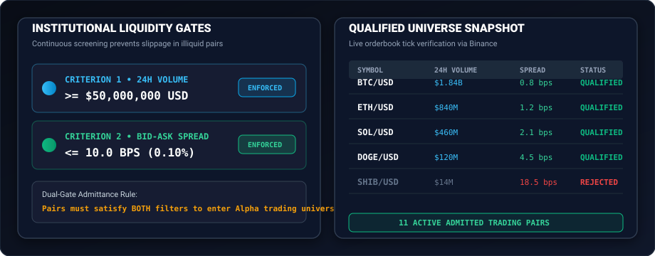<br/><sub><b>123-asset screener</b> — liquidity-qualified universe</sub></td>
  </tr>
</table>

<p align="center">
  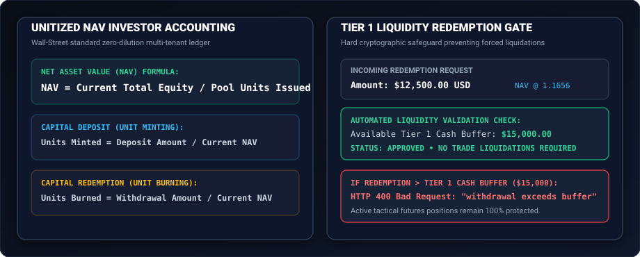
  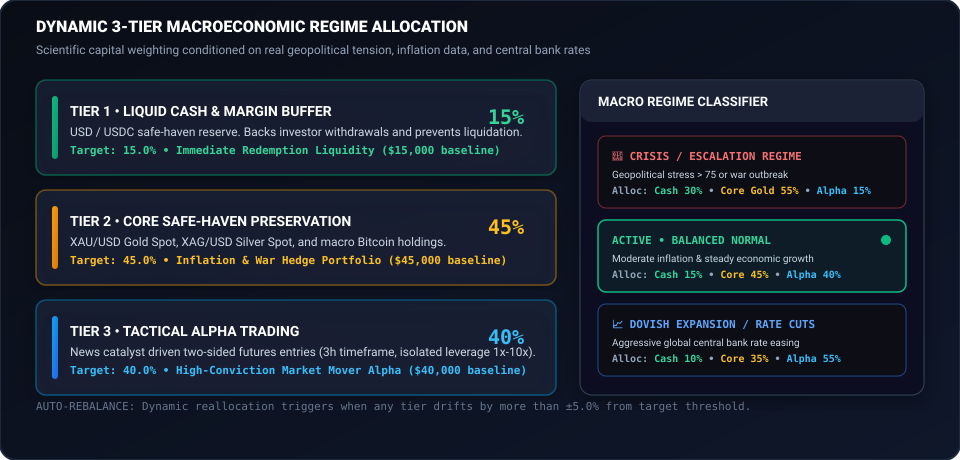
</p>

<p align="center">
  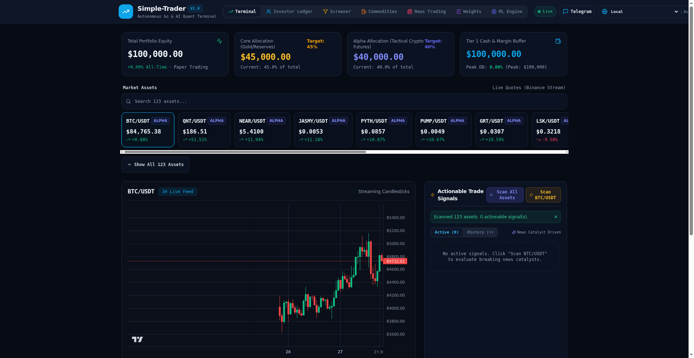
  
</p>

<p align="center">
  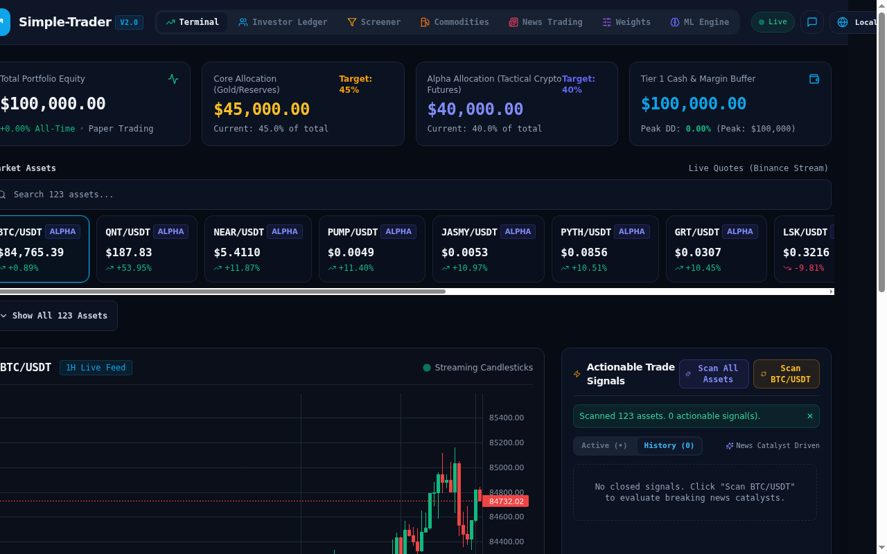
  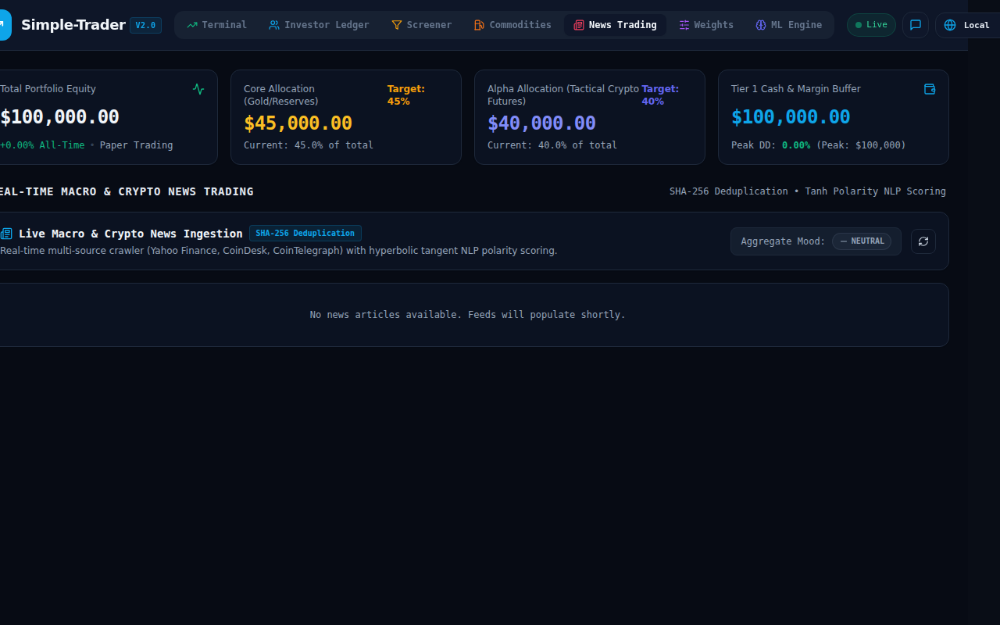
  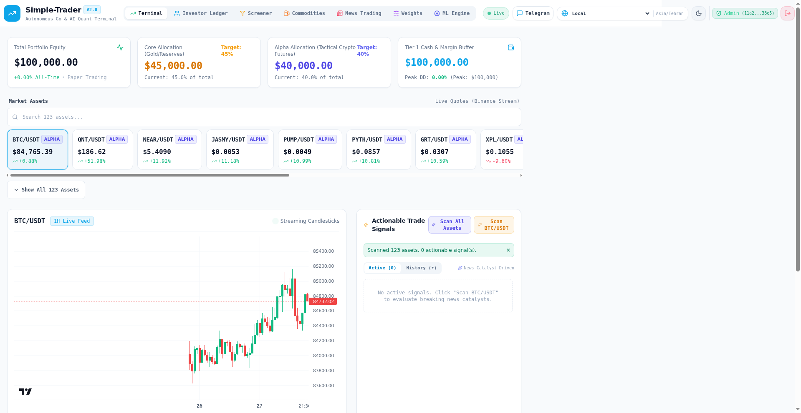
</p>

<p align="center">
  
  <sub>PWA — offline service worker, SSE live stream, dark/light themes, installable on mobile</sub>
</p>

---

## 🧠 Decision Core

**Law**: one decision path owns entry, exit, timeframe, and news impact. Everything else is data.

```
┌────────────── CONTEXT LAYER (no agency) ──────────────┐
│ news clusters · indicators · gates (as fields) ·      │
│ LSTM stats (success rates only) · ATR levels ·        │
│ funding, volatility, macro calendar                   │
│            → one State Object per cycle               │
└──────────────────────┬────────────────────────────────┘
                       ▼
        ┌── DECISION CORE: Jev + 9Router ──┐
        │  Jev first (typed, ~0.5s, cheap) │
        │  confidence < threshold          │
        │   → escalate to 9Router (final)  │
        │  free text (thesis/Telegram)      │
        │   → 9Router                      │
        └──────────────┬───────────────────┘
                       ▼
        typed decision → execution engine
        (LONG/SHORT/NO_TRADE → order side conversion)
```

**Routing**: Jev answers first (`Choice`/`Noul`/`Score` with calibrated distributions). Below `ROUTING_CONFIDENCE_THRESHOLD` → 9Router escalation, its answer final. One writer per decision, route recorded (`jev_direct` | `escalated`).

**Zero-fallback policy**: keyword lexicon deleted · `fallbackHeuristic` deleted · failures = explicit errors with component + reason + cycle id. Never a default, never a substituted judge.

**Futures vocabulary**: core speaks position intent only. `BUY`/`SELL` live in the execution layer (short entry = SELL order, short exit = BUY order).

Spec: [`specs/013-jev-shadow-eval/spec.md`](specs/013-jev-shadow-eval/spec.md) · Research: [`docs/RESEARCH-jev-callisifer.md`](docs/RESEARCH-jev-callisifer.md)

---

## 🆕 v3.1 Features (spec-014 / spec-016 + ops)

- **News-Driven Early Exit (spec-014)**: fresh news clusters re-judged against every open position (`close_now` Noul, one batched call per cycle). "Do not hold" → position closes with `NEWS_EARLY_EXIT` + exactly one Telegram message. Guards: min-hold, per-day budget, cooldown, confidence floor, kill switch — `.env`-configurable, every rejection recorded.
- **Dynamic Trade Timeframe (spec-016)**: the core picks the execution timeframe in the same batched request as the entry judgment — ALPHA `15m/1h/4h` (news dies ≤6h), CORE `1h/4h/12h`. Horizon derives from a timeframe-keyed profile map; exit decay follows each signal's stored timeframe; legacy rows mapped once, logged.
- **Settings persist to `.env`**: `PUT /api/v1/system/config` (session auth + whitelist + range validation) → atomic `.env` write → live in-process apply. Single source of truth, survives redeploys.
- **Event-driven evaluation (spec-020)**: a fresh, relevant headline queues the symbol for an IMMEDIATE entry evaluation (debounce 60s + per-symbol overlap guard). `SCAN_INTERVAL_MINUTES` optionally adds a periodic backstop — unset = event-driven only, no hardcoded cadence.
- **CI parallel matrix**: 11 per-package test jobs + backend/frontend verify — per-package failure visibility, ~65% faster.
- **Optimization 45/45**: engine lock freed from network I/O · `rows.Err()` everywhere · `pgx.Tx` atomicity · Redis cache-aside on hot endpoints · SSE on Redis Pub/Sub · 12 orphan components + ML backend handlers purged · TS `any`-free.

---

## 🚀 Quick Start

```bash
git clone https://github.com/rqzbeh/Simple-Trader.git
cd Simple-Trader
cp .env.example .env
# Edit .env: TYPESAFE_API_KEY (Jev), AI_API_KEY/AI_BASE_URL/AI_MODEL_ID (gateway), ROUTING_CONFIDENCE_THRESHOLD, ADMIN_PASSWORD
docker compose up -d
```

Verify:

```bash
curl http://localhost:8080/health
# {"status":"healthy","version":"3.0.0-decision-core", ...}
curl http://localhost:8080/api/v1/assets | jq '.assets | length'
```

---

## 🌐 Asset Universe (123 Instruments)

Single source of truth: `internal/market/assets.go` → `GET /api/v1/assets`.

**CORE (10 commodities)**: PAXG, XAU (GOLD) · XAG (SILVER) · COPPER · XPT/XPD · OIL/BRENT/NG (Yahoo Finance `CL=F`/`BZ=F`/`NG=F`) · ALUMINUM.

**ALPHA (113 cryptocurrencies)**: non-stablecoin CoinMarketCap top-200 listing on Binance, KuCoin, CoinEx, Kraken. Correlated exposure groups block duplicate risk. Order sizes from live `LOT_SIZE` steps.

---

## 📡 Signal Pipeline & Position Lifecycle

Two-sided (LONG/SHORT), **news-catalyst-first**: no catalyst, no trade.

```
Live ticks ─┐
News crawler ─┴─▶ Context layer: one State Object
                        │
                        ▼
         DECISION CORE (Jev → [escalate] → 9Router)
              + timeframe choice (batched)
                        │  LONG / SHORT / NO_TRADE
                        ▼
              FuturesTradeSignal (PostgreSQL)
                        │
          ┌─────────────┴─────────────┐
          ▼                           ▼
   ExecutionEngine            SSE + Telegram broadcast
          │
          ▼
   Exit: core judges exit-now + NEWS_EARLY_EXIT on fresh news,
   ATR bounds are context, not triggers
          │
          ▼
   Position closed → margin released → Thompson posterior updated
```

Invariants: signals = positions (rehydrated from PostgreSQL) · ATR bounds are context · sizing from clamped margin · `MAX_CONCURRENT_SIGNALS` + correlated blocking · manual close immediate.

---

## 📊 Indicators (context feeders)

Garman-Klass & Parkinson volatility, Kaufman Efficiency Ratio, Chaikin Money Flow, RSI, MACD, Bollinger Bands, SuperTrend, EMA, VWAP, OBI/CVD — computed from authentic candles, **fields in the State Object, never deciders**.

---

## 📡 Feeds & SSE

Batched exchange polling (Binance spot/futures, Yahoo) · Redis microsecond ticker cache · SSE with hydration burst on connect · v3.1: SSE backed by Redis Pub/Sub.

## 📅 Macro Calendar & Halts

Live institutional feed, 30-min refresh. High-impact events halt new entries within ±`CALENDAR_HALT_MINUTES` (state field, not a hidden gate).

## 🧠 ML → Statistics Feeder (offline scripts only)

No ML runs inside the serving backend. ML Engine UI, GPU trainers, training handlers, and the `ml/` training scripts were **removed** (spec-013 v3.0 + optimization pass).

- The decision core consumes only **historical statistics** as context fields — *indicator X settled successful 63% of the time in regime Y*. Thompson posteriors are context.
- **The model never votes, weights, or blocks.**

---

## 🖥️ System Stats & Settings

**System Stats page**: live 9Router gateway + Jev health cards — status dot, total/success/failed, success rate, last/EMA latency, masked key status, routing threshold. Polls every 10 s.

**Settings → `.env`**: Decision Core threshold, risk bounds, guard keys (`EARLY_EXIT_*`), timeframe sets (`TIMEFRAME_SET_*`) — edited in UI, persisted atomically, applied live.

### Required — boot fails listing every missing key (no in-code defaults, spec-017)

Sample values follow the evidence-based recommendations in [`docs/RESEARCH-optimal-params.md`](docs/RESEARCH-optimal-params.md) (Kelly/drawdown/correlation/microstructure research).

| Key | Purpose |
|---|---|
| `TYPESAFE_API_KEY` | Jev (System One) auth — boot FATAL if missing and `JEV_DISABLE` unset |
| `ROUTING_CONFIDENCE_THRESHOLD` | Jev → 9Router escalation cutoff (0..1). No default by design (spec-013 FR-016) |
| `AI_API_KEY` · `AI_BASE_URL` · `AI_MODEL_ID` | OpenAI-compatible gateway (news classify + escalation) — unset key = explicit per-cycle `llm-classifier` error |
| `ADMIN_PASSWORD` | UI access gate — required in production |
| `APP_SECRET` | session-token signing |
| `POSTGRES_USER` · `POSTGRES_PASSWORD` · `POSTGRES_DB` | database (compose builds `DATABASE_URL`) |
| `PORT` · `DATABASE_URL` · `REDIS_URL` · `ENV` | process wiring (compose supplies the first three in Docker) |
| `AI_TEMPERATURE` · `AI_TIMEOUT_SECONDS` · `AI_REASONING_EFFORT` | gateway tuning (samples: `0.2` · `30` · `high`) |
| `JEV_BASE_URL` · `JEV_MODEL` | Jev endpoint/model (samples: `https://api.typesafe.ai` · `jev-latest`) |
| `INITIAL_CAPITAL` · `CORE_TARGET_PCT` · `ALPHA_TARGET_PCT` · `MAX_DRAWDOWN_LIMIT_PCT` | capital & risk envelope |
| `MIN_RISK_PER_TRADE_PCT` · `KELLY_FRACTION` · `MAX_CONCURRENT_SIGNALS` · `IMPACT_FACTOR` | sizing & risk math |
| `CALENDAR_HALT_MINUTES` · `ECONOMIC_CALENDAR_URL` · `SCREENER_MIN_24H_VOLUME` · `SCREENER_MAX_SPREAD_BPS` | macro & liquidity filters |
| `MIN/MAX_STOP_LOSS_PCT` · `MIN/MAX_TAKE_PROFIT_PCT` · `MAKER/TAKER_FEE_RATE` · `MAX_SLIPPAGE_PCT` · `MAX_TRADE_MARGIN_PCT` · `SIGNAL_MAX_AGE_MINUTES` | execution bounds |
| `EARLY_EXIT_*` (5 keys) · `TIMEFRAME_SET_ALPHA/CORE` | feature params (samples match former defaults) |
| `DB_MAX_CONNS` · `DB_MIN_CONNS` | pool sizing (samples `25` · `5`) |
| `TELEGRAM_BOT_TOKEN` · `TELEGRAM_CHAT_ID` | notifications (may be empty until configured) |

One boot error lists **every** missing or unparseable key — copy `.env.example` (complete) to start. `.env` is the single source of truth; the process never substitutes a built-in value.


### Optional — unset = decision core manages (spec-015, spec-019)

Judgment parameters. **Unset/empty → Jev picks the value each cycle** (clamped to hard mechanical bounds). **Set a value → user override wins, core is never asked.** The mode used is recorded per signal and shown in System Stats.

`MIN_RISK_TO_REWARD_RATIO` · `DEFAULT_LEVERAGE` · `MAX_RISK_PER_TRADE_PCT` · `SL_ATR_MULT` · `TP_ATR_MULT` · `CLUSTER_DECAY_MODE` · `CONFLUENCE_MIN` · `EARLY_EXIT_MIN_HOLD_MIN` · `EARLY_EXIT_MAX_PER_DAY` · `EARLY_EXIT_COOLDOWN_MIN` · `EARLY_EXIT_CONF_FLOOR` · `TIMEFRAME_SET_ALPHA` · `TIMEFRAME_SET_CORE`

### Optional — built-in defaults

Delete any of these lines; code uses the default. An invalid value = explicit startup error (never a silent fallback).

| Key | Default |
|---|---|
| `PORT` | `8080` |
| `AI_TEMPERATURE` / `AI_TIMEOUT_SECONDS` / `AI_REASONING_EFFORT` | `0.2` / `30` / `high` |
| `INITIAL_CAPITAL` | `10000` |
| `CORE_TARGET_PCT` / `ALPHA_TARGET_PCT` | `0.50` / `0.40` |
| `KELLY_FRACTION` / `IMPACT_FACTOR` | `0.50` / `0.05` |
| `MIN_RISK_PER_TRADE_PCT` / `MAX_DRAWDOWN_LIMIT_PCT` | `0.005` / `0.08` |
| `MAX_CONCURRENT_SIGNALS` | `3` |
| `MIN_STOP_LOSS_PCT` / `MAX_STOP_LOSS_PCT` | `1.0` / `3.5` |
| `MIN_TAKE_PROFIT_PCT` / `MAX_TAKE_PROFIT_PCT` | `2.0` / `8.0` |
| `MAKER_FEE_RATE` / `TAKER_FEE_RATE` | `0.0002` / `0.0005` |
| `MAX_SLIPPAGE_PCT` / `MAX_TRADE_MARGIN_PCT` | `0.005` / `0.15` |
| `SIGNAL_MAX_AGE_MINUTES` | `45` |
| `CALENDAR_HALT_MINUTES` / `ECONOMIC_CALENDAR_URL` | `15` / faireconomy weekly JSON |
| `SCREENER_MIN_24H_VOLUME` / `SCREENER_MAX_SPREAD_BPS` | `50000000` / `8` |

### Optional — feature keys

| Key | Behavior when unset |
|---|---|
| `EARLY_EXIT_ENABLED` | enabled by default (toggle convention; only explicit `false` disables, spec-019) |
| `EARLY_EXIT_MIN_HOLD_MIN`, `EARLY_EXIT_MAX_PER_DAY`, `EARLY_EXIT_COOLDOWN_MIN`, `EARLY_EXIT_CONF_FLOOR` | core-managed per news cycle by Jev (batched with close_now questions; clamped to safety caps [0,1440], [1,10], [0,1440], [0.5,1.0]); set = user override verbatim (spec-019) |
| `TIMEFRAME_SET_ALPHA` / `TIMEFRAME_SET_CORE` | unrestricted mode (core chooses from all `KnownIntervals` {15m,30m,1h,2h,4h,6h,12h,1d}); set = restricted to listed subset (spec-019) |
| `SHADOW_ENTRY` / `SHADOW_EXIT` / `SHADOW_NEWS` | enabled (`false` disables a channel) |
| `TELEGRAM_BOT_TOKEN` / `TELEGRAM_CHAT_ID` | Telegram notifications off |
| `UPSTREAM_PROXY_URL` | direct connection (`socks5://host:port` or `http://host:port` routes Jev/9Router traffic) |
| `JEV_DISABLE` | decision core on |
| `ENV` | `development` |

**Fail-fast**: missing threshold/key at boot = startup error. Feeder failure = named error in state. Nothing silently pretends to be healthy.

---

## 🛡️ Host-Managed Reverse Proxy (Nginx)

Backend + React PWA on `:8080`; host Nginx: SSL, gzip, SSE streaming (`upstream simple_trader_backend { server 127.0.0.1:8080; }`). Full config: [`docs/DEPLOYMENT_NGINX.md`](docs/DEPLOYMENT_NGINX.md).

---

## 📡 API & SSE Endpoints

`GET /health` · `GET /api/v1/assets` · signals/positions/trades CRUD · `GET /api/v1/events` (SSE) · macro calendar · screener · `GET /api/v1/system/stats` (gateway/Jev health) · `GET|PUT /api/v1/system/config` (settings → `.env`, session-auth) · admin shadow/evidence reports. See spec-013/014/016 `contracts/`.

---

## 🧪 Testing & Evidence

- TDD required (Constitution VI): unit + integration + race detector; chaos suite proves explicit errors, never silent degradation (SC-007).
- Spec-Kit pipeline for every trading-logic change: `/speckit-specify → plan → tasks → implement → converge`.
- CI: 11-package parallel matrix + vet + zero-fallback deletion guards + tsc/vite frontend gate.
- Constitution VIII: risk parameters only from measured distributions; early-exit/timeframe defaults tuned from recorded evidence.

## 📄 License

MIT
